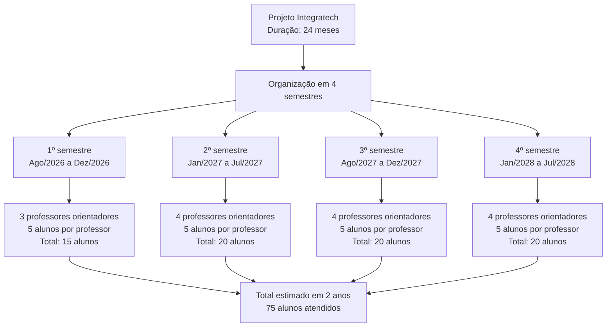
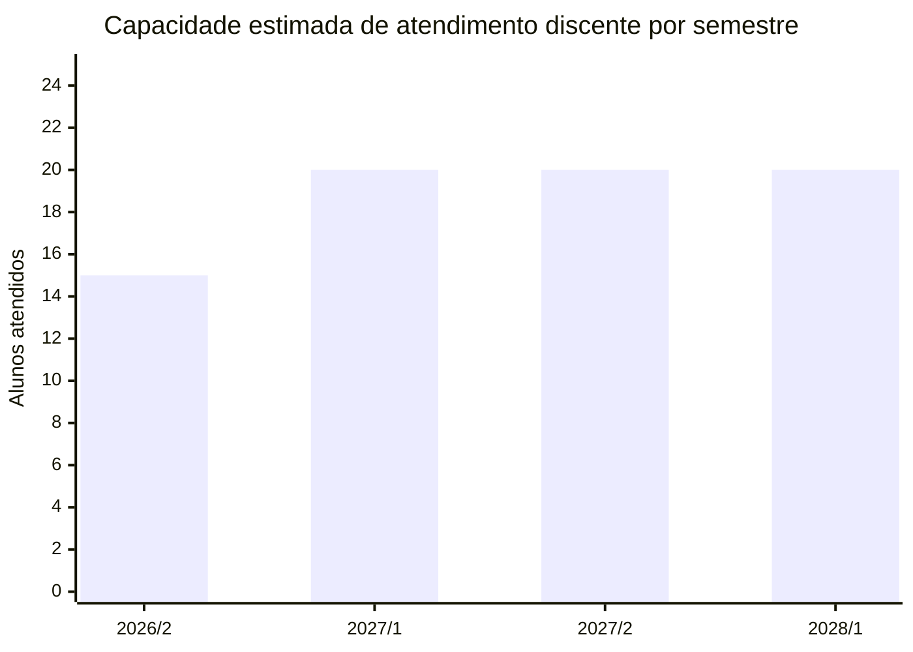
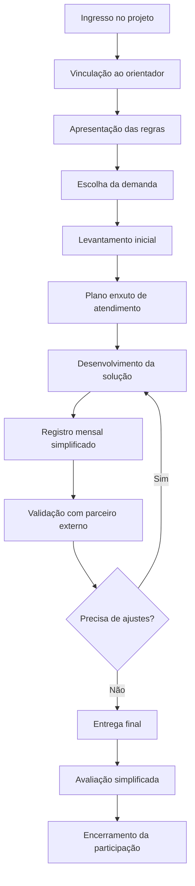
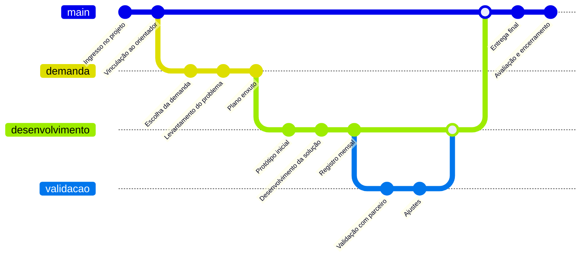
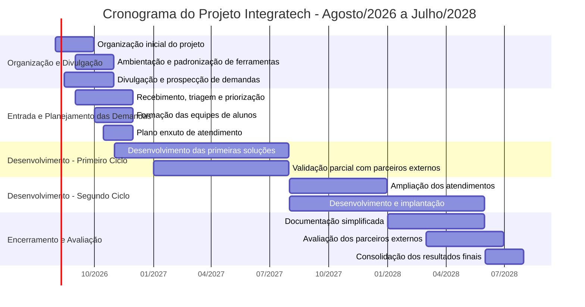
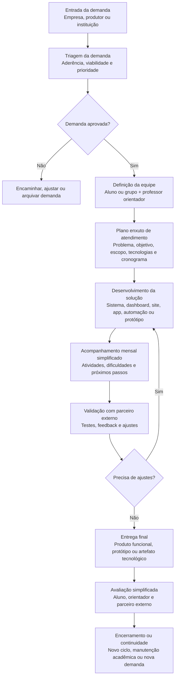
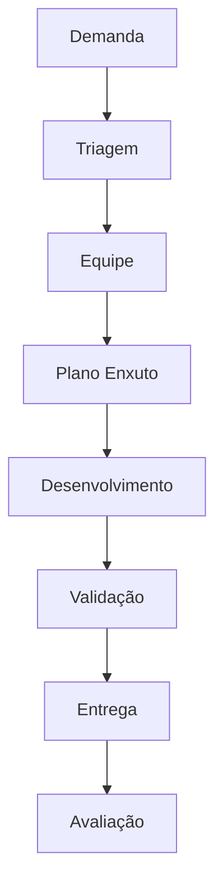

# Integratech

## Projeto de Extensão Universitária

- [Projeto de Extensão Universitária](#projeto-de-extensão-universitária)
- [Laboratório Extensionista de Soluções Digitais, Inovação e Agrocomputação](#laboratório-extensionista-de-soluções-digitais-inovação-e-agrocomputação)
- [1. Identificação do Projeto](#1-identificação-do-projeto)
- [2. Resumo](#2-resumo)
- [3. Justificativa](#3-justificativa)
- [4. Público-alvo](#4-público-alvo)
- [5. Objetivo Geral](#5-objetivo-geral)
- [6. Objetivos Específicos](#6-objetivos-específicos)
- [7. Linhas de Atuação](#7-linhas-de-atuação)
- [7.1 Sistemas de Informação e Software](#71-sistemas-de-informação-e-software)
- [7.2 Dados, Indicadores e Dashboards](#72-dados-indicadores-e-dashboards)
- [7.3 Agrocomputação e Tecnologia para o Agro](#73-agrocomputação-e-tecnologia-para-o-agro)
- [7.4 Inovação, Prototipação e Consultoria Tecnológica](#74-inovação-prototipação-e-consultoria-tecnológica)
- [7.5 Conteúdo Técnico e Disseminação](#75-conteúdo-técnico-e-disseminação)
- [8. Metodologia Simplificada](#8-metodologia-simplificada)
- [8.1 Etapa 1 — Entrada da Demanda e Triagem](#81-etapa-1--entrada-da-demanda-e-triagem)
- [8.2 Etapa 2 — Plano Enxuto de Atendimento](#82-etapa-2--plano-enxuto-de-atendimento)
- [8.3 Etapa 3 — Desenvolvimento, Acompanhamento e Validação](#83-etapa-3--desenvolvimento-acompanhamento-e-validação)
- [8.4 Etapa 4 — Entrega Final e Avaliação](#84-etapa-4--entrega-final-e-avaliação)
- [9. Documentação Mínima Obrigatória](#9-documentação-mínima-obrigatória)
- [10. Tipos de Produtos Esperados](#10-tipos-de-produtos-esperados)
- [11. Organização das Equipes](#11-organização-das-equipes)
- [11.1 Participação Discente e Carga Horária](#111-participação-discente-e-carga-horária)
- [Tabela de Referência de Carga Horária](#tabela-de-referência-de-carga-horária)
- [11.2 Capacidade de Atendimento Discente por Semestre](#112-capacidade-de-atendimento-discente-por-semestre)
- [11.3 Síntese da Capacidade de Atendimento](#113-síntese-da-capacidade-de-atendimento)
- [11.4 Representação Visual da Capacidade de Atendimento](#114-representação-visual-da-capacidade-de-atendimento)
- [11.5 Distribuição semestral](#115-distribuição-semestral)
- [11.6 Regra Operacional](#116-regra-operacional)
- [11.7 Jornada do Discente no Projeto](#117-jornada-do-discente-no-projeto)
- [11.7 Jornada Vertical do Discente no Projeto](#117-jornada-vertical-do-discente-no-projeto)
- [11.8 Trilha de Desenvolvimento do Discente](#118-trilha-de-desenvolvimento-do-discente)
- [12. Responsabilidades dos Participantes](#12-responsabilidades-dos-participantes)
- [12.1 Coordenador](#121-coordenador)
- [12.2 Professores Orientadores](#122-professores-orientadores)
- [12.3 Discentes](#123-discentes)
- [12.4 Empresas, Produtores e Instituições Atendidas](#124-empresas-produtores-e-instituições-atendidas)
- [13. Critérios para Aceitação de Discentes e Demandas](#13-critérios-para-aceitação-de-discentes-e-demandas)
- [13.1 Requisitos Obrigatórios para Início da Atividade](#131-requisitos-obrigatórios-para-início-da-atividade)
- [13.1.1 Critérios para Não Aceitação de Discentes](#1311-critérios-para-não-aceitação-de-discentes)
- [13.2 Critérios para Aceitação da Demanda Externa](#132-critérios-para-aceitação-da-demanda-externa)
- [13.2.1 Critérios de Priorização das Demandas](#1321-critérios-de-priorização-das-demandas)
- [13.3. Modelo de carta de aceitação](#133-modelo-de-carta-de-aceitação)
- [Documentação Mínima Obrigatória](#documentação-mínima-obrigatória)
- [14. Princípios de Funcionamento](#14-princípios-de-funcionamento)
- [15. Cronograma Geral do Projeto](#15-cronograma-geral-do-projeto)
- [15.1 Cronograma em Tabela](#151-cronograma-em-tabela)
- [15.2 Gráfico de Gantt](#152-gráfico-de-gantt)
- [16. Fluxo da Metodologia Simplificada](#16-fluxo-da-metodologia-simplificada)
- [16.1 Etapas do Fluxo](#161-etapas-do-fluxo)
- [16.2 Fluxo em Diagrama](#162-fluxo-em-diagrama)
- [16.3 Síntese Visual da Metodologia](#163-síntese-visual-da-metodologia)
- [17. Integração entre Cronograma e Metodologia](#17-integração-entre-cronograma-e-metodologia)
- [18. Avaliação](#18-avaliação)
- [19. Indicadores de Resultado](#19-indicadores-de-resultado)
- [20. Resultados Esperados](#20-resultados-esperados)
- [21. Observações sobre Propriedade, Uso e Responsabilidade](#21-observações-sobre-propriedade-uso-e-responsabilidade)
- [21.1 Propriedade intelectual e uso da solução](#211-propriedade-intelectual-e-uso-da-solução)
- [21.2 Dados, sigilo, ferramentas e infraestrutura](#212-dados-sigilo-ferramentas-e-infraestrutura)
- [21.3 Limites de manutenção, continuidade e encerramento](#213-limites-de-manutenção-continuidade-e-encerramento)
- [22. Síntese Final](#22-síntese-final)
- [23. Anexo - Modelos de Propriedade Intelectual](#23-anexo---modelos-de-propriedade-intelectual)
- [23.1 Modelo de cessão para a empresa parceira](#231-modelo-de-cessão-para-a-empresa-parceira)
- [23.2 Modelo de licença de uso para a empresa parceira](#232-modelo-de-licença-de-uso-para-a-empresa-parceira)
- [23.3 Modelo de titularidade institucional com autorização de uso](#233-modelo-de-titularidade-institucional-com-autorização-de-uso)

## Laboratório Extensionista de Soluções Digitais, Inovação e Agrocomputação

---

## 1. Identificação do Projeto

| Item | Informação |
|---|---|
| **Título do projeto** | Integratech: Laboratório Extensionista de Soluções Digitais, Inovação e Agrocomputação |
| **Nome curto** | Integratech |
| **Modalidade** | Projeto de Extensão Universitária |
| **Área temática** | Tecnologia, Inovação, Desenvolvimento Regional e Agrocomputação |
| **Coordenador** | Prof. Dr. Emiliano Soares Monteiro |
| **Vice-coordenador** | Prof. Dr. Benevid Félix da Silva |
| **Professores orientadores** | Prof. Dr. Ivan Luiz Pedroso Filho;  Prof. Dr. Benevid Félix da Silva;  Prof. Msc. Francisco Sanches Banhos Filho |
| **Período de execução** | Agosto de 2026 a julho de 2028 |
| **Duração** | 24 meses |
| **Local de execução** | Sinop e região norte de Mato Grosso |
| **Público-alvo** | Empresas, produtores rurais, empreendedores, instituições públicas, organizações da sociedade civil, cooperativas, associações e comunidade regional |
| **Vagas** | Até 5 alunos por professor orientador por semestre, conforme disponibilidade de orientação e compatibilidade das demandas. |

---

## 2. Resumo

O projeto **Integratech: Laboratório Extensionista de Soluções Digitais, Inovação e Agrocomputação** tem como objetivo aproximar a universidade da comunidade regional por meio do atendimento tecnológico a empresas, produtores rurais, empreendedores, instituições e organizações sociais de Sinop e região.

A proposta permitirá que acadêmicos, sob orientação docente, desenvolvam soluções digitais simples, úteis e viáveis para problemas reais da comunidade. As ações poderão envolver sistemas web, aplicativos, dashboards, automações, bancos de dados, análise de dados, protótipos, landing pages, ferramentas de gestão e soluções voltadas ao agronegócio.

O projeto adota uma metodologia simplificada, com menos burocracia que projetos tradicionais, mantendo apenas documentos essenciais para registro, acompanhamento e avaliação das atividades. O foco será a entrega prática, a formação profissional dos alunos e o impacto regional.

---

## 3. Justificativa

Sinop e região possuem forte dinamismo econômico, com destaque para comércio, serviços, educação, logística, setor público, agronegócio, agroindústrias, pequenas empresas e produtores rurais. Muitas dessas organizações enfrentam dificuldades relacionadas à digitalização de processos, controle de informações, gestão de dados, presença digital, automação, análise de indicadores e uso eficiente de tecnologias.

Ao mesmo tempo, os acadêmicos dos cursos da área de tecnologia precisam de experiências práticas, com problemas reais, clientes reais e entregas concretas. O projeto cria uma ponte entre essas duas necessidades: de um lado, a comunidade regional recebe apoio tecnológico; de outro, os estudantes aplicam seus conhecimentos em situações reais de desenvolvimento, consultoria e inovação.

A proposta se inspira em experiências anteriores de extensão, mantendo o foco no atendimento real à comunidade e na produção de soluções tecnológicas, mas reduzindo a quantidade de relatórios e formulários. Assim, o projeto busca ser mais ágil, menos burocrático e mais adequado à dinâmica de empresas, produtores e instituições locais.

---

## 4. Público-alvo

O projeto atenderá:

- empresas de Sinop e região;
- micro e pequenas empresas;
- empreendedores locais;
- produtores rurais;
- propriedades rurais;
- cooperativas;
- associações;
- agroindústrias;
- instituições públicas;
- organizações da sociedade civil;
- profissionais autônomos;
- iniciativas educacionais e comunitárias.

---

## 5. Objetivo Geral

Promover a interação entre universidade, empresas, produtores rurais, instituições e comunidade regional por meio do desenvolvimento de soluções digitais, protótipos, consultorias tecnológicas e produtos de software que contribuam para a inovação, a melhoria de processos e a formação prática dos acadêmicos.

---

## 6. Objetivos Específicos

1. Atender demandas tecnológicas de empresas, produtores rurais, cooperativas, associações, empreendedores e instituições de Sinop e região.

2. Desenvolver soluções digitais de baixa e média complexidade, como sistemas web, dashboards, aplicativos, protótipos, automações, bancos de dados e ferramentas de apoio à gestão.

3. Apoiar demandas do agronegócio e da agrocomputação, incluindo controle de produção, gestão de propriedades, análise de dados, rastreabilidade, indicadores, automação de processos e ferramentas digitais para tomada de decisão.

4. Proporcionar aos acadêmicos experiência prática em projetos reais, envolvendo levantamento de requisitos, planejamento, desenvolvimento, testes, implantação e documentação mínima.

5. Estimular o uso de metodologias ágeis, ferramentas de versionamento, boas práticas de programação, banco de dados, segurança da informação e documentação objetiva.

6. Fortalecer a relação entre a universidade e a comunidade regional, contribuindo para o desenvolvimento social, econômico e tecnológico.

7. Criar um portfólio de soluções, casos atendidos, protótipos e produtos tecnológicos desenvolvidos pelos acadêmicos.

8. Reduzir a burocracia do processo de extensão, mantendo apenas documentos essenciais para registro, acompanhamento e avaliação das atividades.

---

## 7. Linhas de Atuação

### 7.1 Sistemas de Informação e Software

Desenvolvimento de sistemas web, sistemas desktop, aplicativos, APIs, bancos de dados, módulos administrativos, cadastros, relatórios, controle de estoque, controle financeiro básico, CRM simples, sistemas de agendamento e ferramentas de gestão.

### 7.2 Dados, Indicadores e Dashboards

Criação de painéis gerenciais, análise de dados, relatórios automatizados, indicadores de desempenho, visualização de dados, integração com planilhas, bancos de dados e fontes públicas.

### 7.3 Agrocomputação e Tecnologia para o Agro

Soluções voltadas a produtores rurais, empresas agropecuárias, cooperativas, associações e agroindústrias, incluindo controle de produção, gestão de safras, controle de insumos, rastreabilidade, dashboards agropecuários, análise de dados agrícolas e automação de registros.

### 7.4 Inovação, Prototipação e Consultoria Tecnológica

Apoio a ideias inovadoras, protótipos de software, validação inicial de soluções, orientação técnica, escolha de tecnologias, estruturação de MVPs, melhoria de processos digitais e apoio à transformação digital de pequenos negócios.

### 7.5 Conteúdo Técnico e Disseminação

Produção eventual de materiais técnicos simples, vídeos curtos, tutoriais, manuais, guias de uso e publicações digitais sobre as soluções desenvolvidas, respeitando autorização das empresas e instituições atendidas.

---

## 8. Metodologia Simplificada

A metodologia será baseada em ciclos curtos de atendimento, com foco na entrega prática e na documentação mínima. Cada demanda será organizada em quatro macroetapas: entrada e triagem, planejamento enxuto, desenvolvimento e acompanhamento, entrega e avaliação.

### 8.1 Etapa 1 — Entrada da Demanda e Triagem

A empresa, produtor, instituição ou interessado apresentará uma demanda tecnológica ao projeto. A equipe fará uma análise inicial para verificar se a solicitação é compatível com os objetivos, capacidade técnica e disponibilidade dos participantes.

Nesta etapa, serão definidos:

- nome da empresa ou instituição atendida;
- responsável externo;
- problema identificado;
- aluno ou equipe responsável;
- professor orientador;
- tipo de solução esperada;
- viabilidade inicial.

**Documento obrigatório:** Formulário Simplificado de Demanda.

### 8.2 Etapa 2 — Plano Enxuto de Atendimento

Após a aprovação inicial, os alunos elaborarão um plano de atendimento simples, com no máximo duas páginas, contendo:

- problema a ser resolvido;
- objetivo da solução;
- funcionalidades principais;
- tecnologias previstas;
- cronograma resumido;
- responsabilidades dos alunos e da empresa;
- critérios mínimos de conclusão.

**Documento obrigatório:** Plano Enxuto de Atendimento.

### 8.3 Etapa 3 — Desenvolvimento, Acompanhamento e Validação

Os alunos desenvolverão a solução com acompanhamento do professor orientador. O acompanhamento poderá ocorrer por reuniões presenciais, encontros online, mensagens, registros em planilha, repositório de código ou outro meio definido pela equipe.

A cada mês, o aluno ou equipe registrará brevemente:

- atividades realizadas;
- dificuldades encontradas;
- próxima atividade planejada;
- evidências do andamento, como telas, links, prints, repositórios, protótipos ou versões parciais.

**Documento obrigatório:** Registro Mensal Simplificado.

### 8.4 Etapa 4 — Entrega Final e Avaliação

Ao final do atendimento, a equipe apresentará a solução ao responsável externo e ao professor orientador. A entrega poderá ser um sistema funcional, protótipo, dashboard, relatório técnico, banco de dados, script, aplicativo, automação, manual ou outro produto tecnológico compatível com a demanda.

**Documento obrigatório:** Termo de Entrega e Avaliação Simplificada.

---

## 9. Documentação Mínima Obrigatória

Para reduzir a burocracia, cada atendimento terá apenas quatro registros principais:

| Documento | Finalidade |
|---|---|
| **Formulário Simplificado de Demanda** | Registrar a demanda inicial da empresa, produtor ou instituição |
| **Plano Enxuto de Atendimento** | Definir problema, objetivo, escopo, tecnologias, equipe e cronograma |
| **Registro Mensal Simplificado** | Acompanhar atividades realizadas, dificuldades e próximos passos |
| **Termo de Entrega e Avaliação Simplificada** | Registrar a solução entregue e a avaliação do parceiro externo |

Não serão exigidos relatórios extensos por fase, salvo quando a natureza da demanda, a orientação docente ou as normas institucionais exigirem documentação adicional.

---

## 10. Tipos de Produtos Esperados

O projeto poderá gerar:

- sistemas web;
- sistemas desktop;
- aplicativos;
- protótipos navegáveis;
- painéis de dados;
- dashboards em Power BI, Streamlit, Metabase, Looker Studio ou ferramentas similares;
- bancos de dados;
- scripts de automação;
- APIs;
- planilhas automatizadas;
- sistemas para gestão rural;
- ferramentas para controle de estoque, vendas, clientes, produção ou processos internos;
- sites institucionais;
- landing pages;
- relatórios técnicos;
- manuais de uso;
- vídeos curtos de demonstração;
- repositórios de código;
- documentação técnica simplificada.

---

## 11. Organização das Equipes

Cada demanda poderá ser atendida por um aluno individualmente ou por equipe de dois a quatro alunos, conforme complexidade do problema.

Cada aluno ou equipe terá um professor orientador vinculado. O coordenador do projeto acompanhará a distribuição das demandas, a organização geral, o registro institucional das atividades e a consolidação dos resultados.

### 11.1 Participação Discente e Carga Horária

A participação dos discentes no projeto ocorrerá de forma voluntária ou vinculada às atividades de extensão previstas no curso, respeitando as normas institucionais vigentes.

Cada discente poderá dedicar até **12 horas semanais** às atividades do projeto, incluindo reuniões, levantamento de requisitos, desenvolvimento de soluções, documentação, testes, implantação e atendimento aos parceiros externos.

Para fins de certificação e aproveitamento acadêmico, cada discente poderá contabilizar até **300 horas de participação** no projeto.

Considerando a carga máxima semanal prevista, o limite de 300 horas poderá ser alcançado em até **25 semanas de participação efetiva**, podendo o discente iniciar suas atividades em um semestre e concluir no semestre seguinte.

#### Tabela de Referência de Carga Horária

| Tipo de Participação                           | Carga Semanal | Duração Aproximada | Carga Acumulada |
| ---------------------------------------------- | ------------: | -----------------: | --------------: |
| Participação curta                             |   12 h/semana |              1 mês |            48 h |
| Participação bimestral                         |   12 h/semana |            2 meses |            96 h |
| Participação trimestral                        |   12 h/semana |            3 meses |           144 h |
| Participação semestral                         |   12 h/semana |            6 meses |           288 h |
| Participação para integralização das 300 horas |   12 h/semana |       25 semanas |           300 h |

O ingresso e a permanência dos discentes poderão ocorrer em ciclos semestrais, permitindo a entrada contínua de novos participantes ao longo dos 24 meses de execução do projeto. Após a conclusão das 300 horas, o discente poderá continuar colaborando voluntariamente com o projeto, observadas as necessidades das equipes e a disponibilidade dos orientadores.

### 11.2 Capacidade de Atendimento Discente por Semestre

Para garantir acompanhamento adequado, qualidade das entregas e equilíbrio da carga de orientação, cada professor orientador acompanhará **até 5 alunos por semestre**.

No primeiro semestre de execução, o coordenador atuará prioritariamente na organização do projeto, divulgação, triagem das demandas, articulação com empresas, produtores rurais, instituições e parceiros externos. Nesse período, o atendimento direto aos alunos será realizado exclusivamente pelos professores **Prof. Dr. Ivan Luiz Pedroso Filho**, **Prof. Dr. Benevid Félix da Silva** e **Prof. Msc. Francisco Sanches Banhos Filho**.

A partir do segundo semestre, o coordenador também poderá atuar diretamente na orientação discente, ampliando a capacidade de atendimento para até quatro docentes orientadores por semestre.

| Semestre | Período | Professores Orientando | Alunos por Professor | Capacidade de Alunos no Semestre | Observação |
|---|---|---:|---:|---:|---|
| 1º semestre | Agosto a dezembro de 2026 | 3 professores | até 5 alunos | até 15 alunos | Orientação exclusiva de Ivan, Benevid e Francisco; coordenador atua na organização, triagem e articulação externa |
| 2º semestre | Janeiro a julho de 2027 | 4 professores | até 5 alunos | até 20 alunos | Coordenador também poderá orientar alunos |
| 3º semestre | Agosto a dezembro de 2027 | 4 professores | até 5 alunos | até 20 alunos | Continuidade dos atendimentos e entrada de novas demandas |
| 4º semestre | Janeiro a julho de 2028 | 4 professores | até 5 alunos | até 20 alunos | Finalização dos atendimentos e consolidação dos resultados |
| **Total** | **Agosto/2026 a julho/2028** | — | — | **até 75 alunos** | Capacidade estimada ao longo dos 24 meses |

### 11.3 Síntese da Capacidade de Atendimento

| Critério | Definição adotada |
|---|---|
| Duração total do projeto | 24 meses |
| Organização da participação discente | Ciclos semestrais |
| Duração máxima da trilha discente | Até 25 semanas de participação efetiva, podendo atravessar 2 semestres |
| Carga horária máxima por aluno | Até 300 horas |
| Carga semanal máxima por aluno | Até 12 horas semanais |
| Número máximo de alunos por professor | Até 5 alunos por semestre |
| Professores orientadores no 1º semestre | 3 professores |
| Professores orientadores do 2º ao 4º semestre | Até 4 professores |
| Capacidade total estimada | Até 75 alunos |

### 11.4 Representação Visual da Capacidade de Atendimento

### 11.5 Distribuição semestral

### 11.6 Regra Operacional

A organização das vagas seguirá a seguinte regra geral:

cada professor orientador acompanhará até 5 alunos por semestre;
cada aluno poderá concluir sua trilha de participação em até 25 semanas de participação efetiva, podendo iniciar em um semestre e concluir no semestre seguinte;
cada aluno poderá contabilizar até 300 horas no projeto;
no primeiro semestre, o coordenador atuará prioritariamente na organização, divulgação, triagem das demandas e articulação externa;
a partir do segundo semestre, o coordenador poderá também atuar como orientador;
ao final de cada semestre, novas vagas poderão ser abertas para ingresso de outros alunos.

Dessa forma, o projeto mantém uma estrutura simples, com distribuição semestral das vagas e capacidade estimada de atendimento de até 75 discentes ao longo dos 24 meses.

### 11.7 Jornada do Discente no Projeto

A participação do discente no projeto seguirá uma trilha simplificada, organizada em etapas práticas. A jornada inicia com o ingresso no projeto, passa pela escolha da demanda, planejamento, desenvolvimento, validação com o parceiro externo e termina com a entrega final e avaliação.

### 11.7 Jornada Vertical do Discente no Projeto

### 11.8 Trilha de Desenvolvimento do Discente

## 12. Responsabilidades dos Participantes

### 12.1 Coordenador

Compete ao coordenador:

- organizar o projeto;
- articular parcerias;
- divulgar a iniciativa;
- acompanhar a entrada de demandas;
- distribuir atendimentos entre professores e alunos;
- consolidar os resultados;
- elaborar relatórios institucionais;
- zelar pela aderência do projeto aos objetivos da extensão universitária.

O vice-coordenador, **Prof. Dr. Benevid Félix da Silva**, apoiará a coordenação do projeto, podendo colaborar na organização das atividades, na articulação interna, na orientação discente e no acompanhamento dos atendimentos, conforme definição da coordenação.

### 12.2 Professores Orientadores

Compete aos professores orientadores:

- orientar os alunos nos atendimentos;
- validar o escopo das soluções;
- acompanhar o desenvolvimento técnico;
- avaliar entregas parciais e finais;
- apoiar decisões de tecnologia, arquitetura e metodologia;
- registrar a conclusão dos atendimentos sob sua orientação.

### 12.3 Discentes

Compete aos discentes:

- participar das reuniões com empresas e instituições;
- levantar requisitos;
- propor soluções;
- desenvolver os produtos tecnológicos;
- manter registros mínimos de acompanhamento;
- apresentar entregas parciais e finais;
- respeitar as normas internas da empresa parceira e as normas institucionais vigentes da universidade, especialmente quanto a sigilo, uso de dados, segurança da informação e conduta;
- comunicar formalmente ao professor orientador, à coordenação e ao parceiro externo eventual desistência ou impossibilidade de continuidade da atividade;
- agir com ética, responsabilidade e sigilo em relação às informações recebidas.

### 12.4 Empresas, Produtores e Instituições Atendidas

Compete aos parceiros externos:

- apresentar a demanda de forma clara;
- indicar um responsável pelo acompanhamento;
- fornecer informações necessárias ao desenvolvimento;
- acompanhar o desenvolvimento da solução e orientar a equipe quanto às regras internas, processos, necessidades operacionais e critérios de validação;
- quando houver disponibilidade, permitir o uso de notebooks, softwares, acessos ou outros recursos necessários ao desenvolvimento, observadas suas políticas internas;
- validar protótipos e entregas;
- respeitar o caráter acadêmico e extensionista do projeto;
- avaliar a solução ao final do atendimento.

---

## 13. Critérios para Aceitação de Discentes e Demandas

Para ingresso e participação no projeto, o discente deverá atender aos seguintes critérios mínimos:

| Critério | Descrição | Documento/Evidência |
|---|---|---|
| Vínculo acadêmico | Estar regularmente vinculado ao curso ou atividade acadêmica compatível com o projeto | Registro acadêmico ou inscrição no projeto |
| Professor orientador definido | O aluno deverá ter um professor orientador responsável pelo acompanhamento das atividades | Registro de vinculação do orientador |
| Demanda externa aceita | A empresa, produtor rural, instituição ou parceiro externo deverá formalizar aceite para participação no projeto | Carta de Aceite da empresa/instituição/parceiro |
| Plano de trabalho compatível | A proposta de atividade deverá ser compatível com os objetivos do projeto e com a carga horária prevista | Plano Enxuto de Atendimento |
| Viabilidade técnica | A demanda deverá ser compatível com o conhecimento dos alunos, disponibilidade dos orientadores e prazo de execução | Avaliação da coordenação e do professor orientador |
| Conduta ética e sigilo | O aluno deverá respeitar informações, dados e documentos fornecidos pelo parceiro externo | Termo ou declaração de responsabilidade, quando necessário |

### 13.1 Requisitos Obrigatórios para Início da Atividade

O discente somente poderá iniciar oficialmente suas atividades no projeto após cumprir os seguintes requisitos:

1. possuir **professor orientador definido**;
2. apresentar ou estar vinculado a uma **demanda externa aprovada**;
3. entregar a **Carta de Aceite da empresa, produtor rural, instituição ou parceiro externo**;
4. elaborar o **Plano Enxuto de Atendimento**, validado pelo professor orientador;
5. ter sua participação registrada pela coordenação do projeto.

A Carta de Aceite deverá indicar que o parceiro externo concorda em participar do projeto, fornecer as informações necessárias, acompanhar o desenvolvimento da solução e validar as entregas realizadas pelo discente ou equipe.

### 13.1.1 Critérios para Não Aceitação de Discentes

O ingresso ou a permanência do discente poderá não ser aceito nas seguintes situações:

| Critério de não aceitação | Descrição |
|---|---|
| Ausência de carga horária docente disponível | Não haverá ingresso quando os professores orientadores não tiverem disponibilidade de carga horária para acompanhamento |
| Incompatibilidade da área proposta | Não haverá ingresso quando a área proposta pelo aluno ou a demanda vinculada da empresa não for compatível com as áreas de atuação dos orientadores disponíveis |
| Licença ou afastamento de orientadores | Não haverá ingresso quando os orientadores estiverem em licença-saúde, licença-prêmio, afastamento institucional ou outra condição que inviabilize a orientação |
| Incompatibilidade tecnológica ou metodológica | Não haverá ingresso quando as tecnologias, metodologias ou abordagem propostas não estiverem alinhadas ao trabalho desenvolvido pelos professores orientadores |
| Falta de demanda viável ou parceiro formalizado | Não haverá ingresso quando o discente não estiver vinculado a demanda compatível, com parceiro externo definido e aceite formal |
| Descumprimento de requisitos institucionais | Não haverá ingresso quando o discente não atender aos requisitos acadêmicos, documentais, éticos ou operacionais definidos pelo projeto e pela universidade |
| Outros impedimentos justificados | A coordenação poderá indeferir o ingresso em situações excepcionais devidamente justificadas, relacionadas à viabilidade, ao risco, à responsabilidade técnica ou ao interesse institucional |

### 13.2 Critérios para Aceitação da Demanda Externa

As demandas apresentadas por empresas, produtores rurais, instituições ou parceiros externos serão avaliadas conforme os seguintes critérios:

| Critério | Descrição |
|---|---|
| Aderência ao projeto | A demanda deve estar relacionada a soluções digitais, inovação, agrocomputação, dados, automação, sistemas ou apoio tecnológico |
| Viabilidade de execução | A solução deve ser possível de ser desenvolvida dentro da carga horária prevista, em até 25 semanas de participação efetiva, ou organizada em etapas compatíveis |
| Disponibilidade de orientação | Deve haver professor orientador disponível para acompanhar o aluno ou equipe |
| Aceite formal do parceiro | A empresa ou instituição deverá entregar Carta de Aceite formalizando a participação |
| Relevância formativa | A demanda deve contribuir para a formação prática do discente |
| Relevância social, econômica ou regional | A demanda deve ter potencial de benefício para a empresa, produtor, instituição ou comunidade |
| Clareza do problema | O parceiro externo deve apresentar uma necessidade minimamente compreensível e viável de ser analisada |
| Ausência de impedimentos éticos ou legais | A demanda não poderá envolver atividade ilegal, risco indevido, violação de dados ou responsabilidade técnica incompatível com o projeto |

Demandas sem professor orientador definido, sem Carta de Aceite do parceiro externo ou incompatíveis com os objetivos do projeto não serão iniciadas formalmente.

### 13.2.1 Critérios de Priorização das Demandas

Quando houver número de demandas superior à capacidade de atendimento do projeto, a priorização observará os seguintes critérios:

| Critério de priorização | Diretriz de decisão |
|---|---|
| Aderência aos objetivos do projeto | Terão prioridade demandas claramente relacionadas a soluções digitais, dados, automação, software ou agrocomputação |
| Compatibilidade com o limite de 300 horas | Terão prioridade demandas com escopo possível de ser entregue dentro da carga horária máxima prevista para o discente ou equipe |
| Potencial formativo | Terão prioridade demandas que proporcionem aprendizado técnico relevante aos alunos |
| Impacto social, econômico ou regional | Terão prioridade demandas com potencial concreto de benefício para a comunidade, empresa, produtor ou instituição atendida |
| Maturidade e clareza da demanda | Terão prioridade demandas com problema bem definido, responsável externo identificado e informações mínimas disponíveis |
| Disponibilidade de acompanhamento do parceiro | Terão prioridade demandas cujo parceiro se comprometa a acompanhar, orientar e validar o desenvolvimento |
| Risco jurídico, ético e operacional | Demandas com menor risco relacionado a dados pessoais, sigilo, dependências críticas ou responsabilidade técnica terão prioridade |

Em caso de empate entre demandas com características semelhantes, a coordenação e os orientadores poderão considerar a ordem de entrada, a disponibilidade de professores e a distribuição equilibrada entre áreas de atuação do projeto.

### 13.3. Modelo de carta de aceitação

**CARTA DE ACEITE DA EMPRESA/PARCEIRO EXTERNO**

Eu, **[nome do responsável]**, representante da **[nome da empresa, instituição, cooperativa, associação ou propriedade rural]**, inscrita no **[CNPJ/identificação]**, declaro que aceito participar do projeto **Integratech: Laboratório Extensionista de Soluções Digitais, Inovação e Agrocomputação**, vinculando-me à demanda descrita a seguir:

- parceiro externo: **[nome da empresa/instituição]**;
- responsável pelo acompanhamento: **[nome completo]**;
- contato: **[telefone/e-mail]**;
- descrição resumida da demanda: **[descrever problema, necessidade ou oportunidade]**;
- solução esperada: **[sistema, dashboard, automação, site, aplicativo, relatório, protótipo ou outro]**;
- data prevista de início: **[dd/mm/aaaa]**;
- data prevista de encerramento/entrega: **[dd/mm/aaaa]**.

Declaro, ainda, que:

1. autorizo o desenvolvimento acadêmico da solução no âmbito do projeto;
2. comprometo-me a disponibilizar informações necessárias ao entendimento da demanda, respeitados os limites de sigilo e confidencialidade;
3. comprometo-me a acompanhar o desenvolvimento da atividade por meio de reuniões, mensagens, validações parciais ou outro formato definido com a equipe;
4. comprometo-me a orientar os alunos quanto às regras internas, processos, necessidades operacionais e critérios mínimos de validação da solução;
5. estou ciente de que o projeto possui caráter acadêmico e extensionista, não substituindo contrato comercial de desenvolvimento, suporte técnico permanente ou manutenção continuada;
6. estou ciente de que o escopo da atividade deverá ser compatível com a carga horária máxima do discente ou equipe, limitada ao planejamento aprovado no projeto;
7. estou ciente de que a certificação de horas do discente depende da entrega final regular da proposta e do encerramento validado no projeto, não sendo devida certificação quando o aluno não concluir a atividade;
8. comprometo-me a validar, ao final, a entrega realizada e registrar avaliação sobre o atendimento recebido.

Quando aplicável, declaro também que:

- informarei previamente eventuais restrições de acesso, sigilo, uso de dados, uso de sistemas internos ou normas específicas da empresa/instituição;
- autorizarei, conforme disponibilidade e interesse, o uso de notebooks, softwares, acessos ou outros recursos necessários ao desenvolvimento, observadas as políticas internas do parceiro.

Local e data: **[cidade], [dia] de [mês] de [ano]**

Assinatura do responsável externo: **________________________________**

Nome completo: **________________________________**

Cargo/função: **________________________________**

### Documentação Mínima Obrigatória

| Documento | Finalidade |
|---|---|
| Formulário Simplificado de Demanda | Registrar a demanda inicial da empresa, produtor rural, instituição ou parceiro externo |
| Carta de Aceite da Empresa/Instituição Parceira | Formalizar a concordância do parceiro externo em participar do projeto e acompanhar a execução da solução |
| Registro de Vinculação do Professor Orientador | Indicar o professor responsável pelo acompanhamento do discente ou equipe |
| Plano Enxuto de Atendimento | Definir problema, objetivo, escopo, tecnologias, equipe e cronograma |
| Registro Mensal Simplificado | Acompanhar atividades realizadas, dificuldades e próximos passos |
| Termo de Entrega e Avaliação Simplificada | Registrar a solução entregue e a avaliação do parceiro externo |

---

## 14. Princípios de Funcionamento

O projeto será orientado pelos seguintes princípios:

- simplicidade;
- baixo nível de burocracia;
- foco em problemas reais;
- entregas práticas;
- responsabilidade acadêmica;
- ética no uso de dados e informações;
- proteção de dados pessoais, sigilo e segurança da informação;
- conformidade com normas institucionais vigentes da universidade e com as regras internas do parceiro externo;
- respeito às limitações dos alunos;
- colaboração entre universidade e comunidade;
- uso preferencial de tecnologias acessíveis;
- incentivo à inovação regional.

---

## 15. Cronograma Geral do Projeto

O projeto terá duração de **24 meses**, com início em **agosto de 2026** e término em **julho de 2028**. As atividades serão organizadas em ciclos de atendimento, permitindo a entrada contínua de novas demandas e a finalização gradual das soluções desenvolvidas pelos alunos.

### 15.1 Cronograma em Tabela

| Etapa | Atividade | Período | Responsáveis | Produto/Resultado Esperado |
|---|---|---|---|---|
| 1 | Organização inicial do projeto | Agosto a setembro de 2026 | Coordenador e professores orientadores | Projeto estruturado, canais definidos e materiais de divulgação preparados |
| 2 | Ambientação inicial dos alunos e padronização de ferramentas | Setembro a outubro de 2026 | Coordenador e orientadores | Alunos alinhados às regras do projeto, ferramentas definidas e fluxo de trabalho organizado |
| 3 | Divulgação e prospecção de demandas | Agosto a outubro de 2026 | Coordenador, orientadores e alunos | Empresas, produtores e instituições interessados cadastrados |
| 4 | Recebimento, triagem e priorização das demandas | Setembro a novembro de 2026 | Coordenador e orientadores | Demandas avaliadas e classificadas por área, viabilidade, prioridade e aderência ao limite de 300 horas |
| 5 | Formação das equipes e elaboração do plano enxuto de atendimento | Outubro a novembro de 2026 | Alunos e orientadores | Alunos vinculados às demandas e plano com problema, objetivo, escopo, tecnologias e cronograma resumido |
| 6 | Desenvolvimento das primeiras soluções | Novembro de 2026 a julho de 2027 | Alunos e orientadores | Protótipos, sistemas, dashboards, sites, APIs ou automações em desenvolvimento |
| 7 | Validação parcial com parceiros externos | Janeiro a julho de 2027 | Alunos, orientadores e parceiros externos | Ajustes nas soluções conforme feedback das empresas ou instituições |
| 8 | Ampliação dos atendimentos | Agosto a dezembro de 2027 | Coordenador, orientadores e alunos | Entrada de novas demandas e continuidade dos projetos existentes |
| 9 | Desenvolvimento e implantação das soluções | Agosto de 2027 a maio de 2028 | Alunos e orientadores | Soluções finalizadas, implantadas ou entregues como protótipos funcionais |
| 10 | Produção de documentação simplificada | Janeiro a maio de 2028 | Alunos e orientadores | Manuais, vídeos curtos, guias de uso e registros técnicos simplificados |
| 11 | Avaliação dos parceiros externos | Março a junho de 2028 | Coordenador, orientadores, alunos e parceiros | Termos de entrega e avaliações de satisfação preenchidos |
| 12 | Consolidação dos resultados finais | Junho a julho de 2028 | Coordenador e orientadores | Relatório final institucional, indicadores consolidados e proposta de continuidade |

### 15.2 Gráfico de Gantt

---

## 16. Fluxo da Metodologia Simplificada

A metodologia do projeto será organizada em um fluxo simples, com entrada da demanda, triagem, planejamento enxuto, desenvolvimento, validação e entrega final. O objetivo é reduzir a burocracia, mantendo apenas os registros essenciais para acompanhamento e avaliação.

### 16.1 Etapas do Fluxo

| Ordem | Etapa | Descrição | Documento/Evidência |
|---|---|---|---|
| 1 | Entrada da demanda | Empresa, produtor, instituição ou empreendedor apresenta uma necessidade tecnológica | Formulário Simplificado de Demanda |
| 2 | Triagem | Coordenação e orientadores analisam aderência, viabilidade e prioridade da demanda | Registro de triagem |
| 3 | Definição da equipe | Alunos e professor orientador são vinculados à demanda aprovada | Registro da equipe |
| 4 | Plano enxuto de atendimento | Equipe define problema, objetivo, escopo, tecnologias, cronograma e critérios de entrega | Plano Enxuto de Atendimento |
| 5 | Desenvolvimento da solução | Alunos desenvolvem sistema, protótipo, dashboard, automação, site, aplicativo ou outro produto | Repositório, telas, protótipos ou versões parciais |
| 6 | Acompanhamento mensal | Equipe registra atividades realizadas, dificuldades e próximos passos | Registro Mensal Simplificado |
| 7 | Validação com parceiro externo | A solução é apresentada ao parceiro para testes, feedback e ajustes | Registro de validação |
| 8 | Entrega final | Produto é entregue como solução funcional, protótipo validado ou artefato tecnológico | Termo de Entrega e Avaliação Simplificada |
| 9 | Avaliação e encerramento | Professor, aluno e parceiro avaliam resultados, aprendizados e possibilidade de continuidade | Avaliação final simplificada |

### 16.2 Fluxo em Diagrama

### 16.3 Síntese Visual da Metodologia

---

## 17. Integração entre Cronograma e Metodologia

O projeto será executado em ciclos. Isso significa que nem todas as demandas precisarão iniciar e terminar ao mesmo tempo. Algumas soluções poderão ser concluídas em poucos meses, enquanto outras poderão atravessar mais de um semestre, conforme sua complexidade.

A lógica de funcionamento será:

1. **Demanda simples:** atendimento em ciclo curto, com duração aproximada de 2 a 4 meses.
2. **Demanda média:** atendimento em ciclo semestral, com duração aproximada de 4 a 6 meses.
3. **Demanda complexa:** atendimento em ciclo estendido, podendo envolver mais de uma equipe ou mais de um semestre.

Esse modelo permite que o projeto mantenha fluxo contínuo de entrada, desenvolvimento e entrega de soluções, evitando excesso de burocracia e favorecendo a participação prática dos alunos.

---

## 18. Avaliação

A avaliação será contínua e simplificada, considerando:

- número de demandas recebidas;
- número de demandas atendidas;
- número de alunos participantes;
- número de empresas, produtores ou instituições atendidas;
- produtos tecnológicos desenvolvidos;
- soluções implantadas ou prototipadas;
- avaliação dos parceiros externos;
- participação dos alunos;
- qualidade das entregas;
- aprendizado técnico e profissional dos discentes;
- impacto percebido na comunidade.

A avaliação não terá como foco a produção de relatórios extensos, mas sim a comprovação objetiva das atividades realizadas e dos produtos entregues.

---

## 19. Indicadores de Resultado

| Indicador | Forma de verificação |
|---|---|
| Demandas recebidas | Formulários de demanda |
| Demandas atendidas | Registros de atendimento |
| Empresas/produtores/instituições atendidas | Cadastro dos parceiros externos |
| Alunos participantes | Lista de discentes vinculados |
| Produtos tecnológicos desenvolvidos | Repositórios, sistemas, protótipos, dashboards ou documentos |
| Soluções ligadas ao agro | Classificação da linha de atuação |
| Satisfação dos parceiros | Avaliação simplificada final |
| Soluções implantadas ou prototipadas | Termo de entrega |
| Materiais técnicos produzidos | Manuais, vídeos, guias ou relatórios simplificados |

---

## 20. Resultados Esperados

Espera-se que o projeto contribua para:

- fortalecimento da relação entre universidade e comunidade regional;
- melhoria de processos em empresas, produtores rurais e instituições atendidas;
- desenvolvimento de soluções digitais úteis e acessíveis;
- formação prática dos acadêmicos;
- ampliação do portfólio técnico dos estudantes;
- estímulo à inovação em Sinop e região;
- apoio à transformação digital de pequenos negócios e iniciativas locais;
- criação de soluções aplicadas ao agronegócio e à agrocomputação;
- consolidação de uma metodologia extensionista mais simples, prática e menos burocrática.

---

## 21. Observações sobre Propriedade, Uso e Responsabilidade

As soluções desenvolvidas no âmbito do projeto terão caráter acadêmico e extensionista.

### 21.1 Propriedade intelectual e uso da solução

A empresa parceira poderá receber direitos de uso, exploração econômica, cessão ou licença da solução desenvolvida para sua própria demanda, desde que isso esteja previsto de forma expressa na Carta de Aceite, no Plano Enxuto de Atendimento ou em termo específico, sempre observadas as normas institucionais vigentes da universidade e a legislação aplicável.

Na ausência de instrumento específico, a titularidade, o uso do código-fonte, a divulgação e a disponibilização da solução deverão seguir a legislação aplicável e as regras institucionais da universidade.

Para cada demanda, recomenda-se que a coordenação, o orientador e o parceiro externo escolham expressamente um dos modelos apresentados no **Anexo - Modelos de Propriedade Intelectual**, registrando essa definição na Carta de Aceite, no Plano Enxuto de Atendimento ou em termo complementar.

### 21.2 Dados, sigilo, ferramentas e infraestrutura

Quando houver tratamento de dados pessoais, dados empresariais ou informações sensíveis, os participantes deverão respeitar as normas internas do parceiro externo, as normas institucionais vigentes da universidade e a legislação aplicável, especialmente a **Lei nº 13.709/2018 (LGPD)**, adotando tratamento restrito à finalidade do projeto, acesso mínimo necessário, sigilo e cuidados básicos de segurança da informação.

Os trabalhos poderão ser executados com notebooks, softwares, contas, acessos e recursos eventualmente disponibilizados pela empresa parceira, quando houver, ou com equipamentos e infraestrutura já existentes nos laboratórios da universidade. A definição prática das ferramentas de trabalho será registrada no plano de atendimento de cada demanda.

### 21.3 Limites de manutenção, continuidade e encerramento

O projeto não substituirá contratos profissionais de desenvolvimento de software, suporte técnico permanente ou manutenção comercial. O projeto também não prevê acompanhamento contínuo da solução após o encerramento das atividades do discente, salvo se houver novo ciclo acadêmico formalmente aprovado.

Por essa razão, o escopo das soluções deverá ser compatível com a carga horária máxima de até 300 horas por discente ou com a carga horária global prevista para a equipe responsável.

Em caso de desistência ou abandono da atividade, o discente deverá comunicar formalmente a coordenação, o professor orientador e o parceiro externo. Nessas situações, as horas não serão contabilizadas para fins de certificação, e o certificado somente será emitido quando houver entrega final regular e encerramento validado no projeto.

---

## 22. Síntese Final

O **Integratech: Laboratório Extensionista de Soluções Digitais, Inovação e Agrocomputação** propõe um modelo de extensão universitária simples, prático e menos burocrático, voltado ao atendimento de demandas reais da comunidade.

A proposta preserva o melhor dos modelos anteriores: o atendimento tecnológico aplicado, o desenvolvimento de soluções reais e a formação prática dos acadêmicos. Ao mesmo tempo, reduz o excesso de relatórios, simplifica o acompanhamento e prioriza entregas úteis para empresas, produtores rurais, empreendedores e instituições de Sinop e região.

---

## 23. Anexo - Modelos de Propriedade Intelectual

### 23.1 Modelo de cessão para a empresa parceira

**Modelo resumido de cláusula**

As partes acordam que os direitos patrimoniais de uso e exploração da solução desenvolvida no âmbito desta demanda serão cedidos à empresa parceira **[nome da empresa]**, para utilização em suas atividades internas e finalidades institucionais ou empresariais, conforme escopo aprovado no projeto. O discente autor e a universidade poderão manter registro acadêmico da atividade, preservada a autoria e observadas as restrições de sigilo, confidencialidade e normas institucionais aplicáveis.

### 23.2 Modelo de licença de uso para a empresa parceira

**Modelo resumido de cláusula**

As partes acordam que a solução desenvolvida no âmbito desta demanda permanecerá com titularidade definida conforme instrumento específico e normas institucionais aplicáveis, ficando a empresa parceira **[nome da empresa]** licenciada para uso da solução no contexto de sua própria operação, sem transferência automática de titularidade do código-fonte, salvo disposição expressa em contrário. O alcance da licença, eventuais restrições de compartilhamento e condições de continuidade deverão constar no Plano Enxuto de Atendimento ou em termo próprio.

### 23.3 Modelo de titularidade institucional com autorização de uso

**Modelo resumido de cláusula**

As partes acordam que a solução desenvolvida no âmbito desta demanda permanecerá vinculada à titularidade institucional ou ao regime definido pela universidade, sendo concedida à empresa parceira **[nome da empresa]** autorização de uso da solução para fins internos, educacionais, operacionais ou de validação, conforme escopo aprovado. Eventual ampliação de uso, cessão a terceiros, exploração comercial ou transferência de código-fonte dependerá de instrumento específico e autorização expressa das partes competentes.

